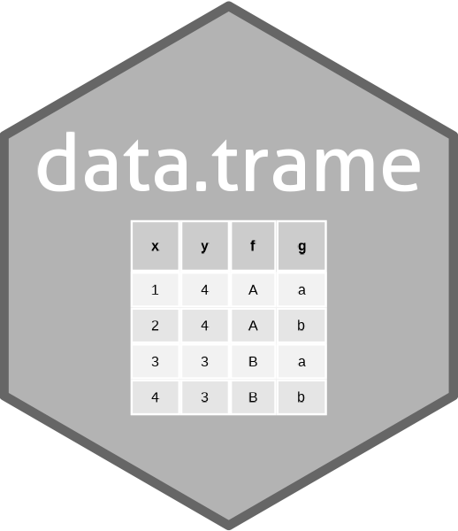

<!-- README.md is generated from README.Rmd. Please edit that file -->

```{r, include=FALSE}
knitr::opts_chunk$set(collapse = TRUE, comment = "#>",
  fig.path = "man/figures/README-", out.width = "100%")
```

# 'SciViews::R' - A Better Data Frame <a href="https://www.sciviews.org/data.trame"></a>

<!-- badges: start -->
[](https://github.com/SciViews/data.trame/actions/workflows/R-CMD-check.yaml)
[](https://codecov.io/gh/SciViews/data.trame)
[](https://cran.r-project.org/package=data.trame)
[](https://sciviews.r-universe.dev/data.trame)
[](https://opensource.org/license/mit)
[](https://lifecycle.r-lib.org/articles/stages.html#stable)
<!-- badges: end -->

**data.trame** is an hybrid **data.table** - **tibble** - **data.frame** object for the SciViews::R dialect. It enhances **data.frame** with the speed of **data.table** and the nice features of **tibble** (stricter syntax, pretty printing...)

## Installation

{data.trame} is not available from CRAN yet. You should install it from the [SciViews R-Universe](https://sciviews.r-universe.dev). To install this package and its dependencies, run the following command in R:

```{r, eval=FALSE}
install.packages('data.trame', repos = c('https://sciviews.r-universe.dev',
  'https://cloud.r-project.org'))
```

You can also install the latest development version. Make sure you have the {remotes} R package installed:

``` r
install.packages("remotes")
```

Use `install_github()` to install the {data.trame} package from GitHub (source from **main** branch will be recompiled on your machine):

``` r
remotes::install_github("SciViews/data.trame")
```

R should install all required dependencies automatically, and then it should compile and install {data.trame}.


## Further explore {data.trame}

You can get further help about this package this way: Make the {data.trame} package available in your R session:

``` r
library('data.trame')
```

Get help about this package:

``` r
library(help = "data.trame")
help("data.trame-package")
vignette("data.trame") # Note: not installed with install_github()
```

For further instructions, please, refer to the help pages at <https://www.sciviews.org/data.trame/>.

## Code of Conduct

Please note that the {data.trame} package is released with a [Contributor Code of Conduct](https://contributor-covenant.org/version/2/1/CODE_OF_CONDUCT.html). By contributing to this project, you agree to abide by its terms.
